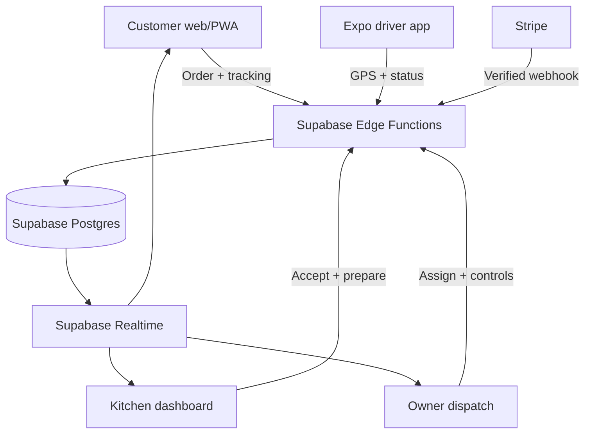
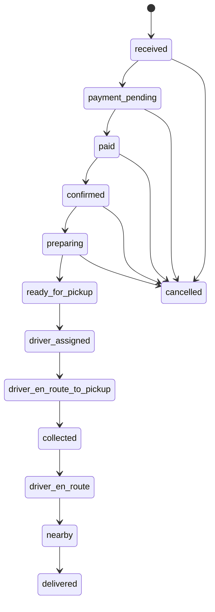

# Architecture

## Product shape

The first release is a focused, one-restaurant system. It is not a marketplace pretending to be Deliveroo. Keeping one merchant makes the important bit—reliable orders and honest tracking—small enough to prove.

## Applications

| Surface | Technology | User | Must work first |
| --- | --- | --- | --- |
| `apps/web` | Next.js App Router, TypeScript, PWA, Supabase SSR | customer, kitchen, owner | menu, checkout, kitchen queue, dispatch, customer tracking |
| `apps/mobile` | Expo Router, TypeScript, Expo Location | driver | availability, job offer, GPS consent, route, status, proof |
| `packages/shared` | TypeScript, Zod, generated Supabase types | all apps | prices, statuses, API contracts, validation |
| `supabase` | Postgres migrations, Edge Functions, Storage policies | backend | auth, RLS, orders, payments, realtime location |

The web app can be installed as a PWA. The driver app becomes Android/iOS with Expo Application Services or local builds; it is not merely a web view.

## Core status machine

An order event is written for every state change. Browser code cannot move an order directly: it calls a validated server path, which checks the actor and state transition.

## Mode gate

`runtime_mode` starts as `demo`. Demo records carry `is_demo = true`, fake payment IDs and a conspicuous badge. Real data is never mixed into demo screens. The Live toggle is server-authoritative and only becomes available after the readiness function confirms:

- Supabase connection and RLS tests pass;
- Stripe test then live settings and webhook are configured;
- maps tiles/directions are configured;
- legal/support URLs are set;
- at least one owner, approved kitchen account and approved driver exist;
- a service zone and published fee policy exist;
- owner has completed the explicit confirm/re-authentication flow.

## Authority boundaries

| Operation | Must run where | Why |
| --- | --- | --- |
| Price a basket / create order | `create-order` Edge Function | Client totals can be changed or replayed |
| Start/refund a payment | server-only function/webhook | Stripe secrets never reach browser/mobile |
| Kitchen acceptance, cancellation, dispatch | signed Edge Function | validates role and state transition |
| Driver GPS update | `record-driver-location` Edge Function | driver must be assigned to that active order |
| Change fee/mode/settings | owner-only Edge Function | audit reason and hard Live gate |
| Customer map subscription | RLS-protected Realtime | prevents drivers or strangers being exposed |

## Data decisions

- All money is integer `*_pence`, never float pounds.
- Menu and pricing values are snapshotted into the order at checkout.
- An order has one current driver assignment plus an immutable assignment history.
- GPS has a one-row `driver_live_locations` store per active delivery. History is optional and short-retention; it is not required for customer tracking.
- Delivery address is private order data. It is never placed on a public map, sent in a URL or listed for other drivers.
- The service-role key exists only in Edge Functions/server runtime. Apps use the Supabase publishable key and rely on RLS.

